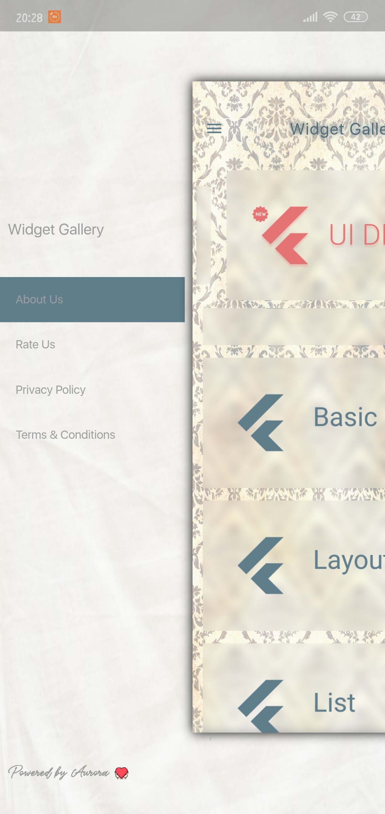
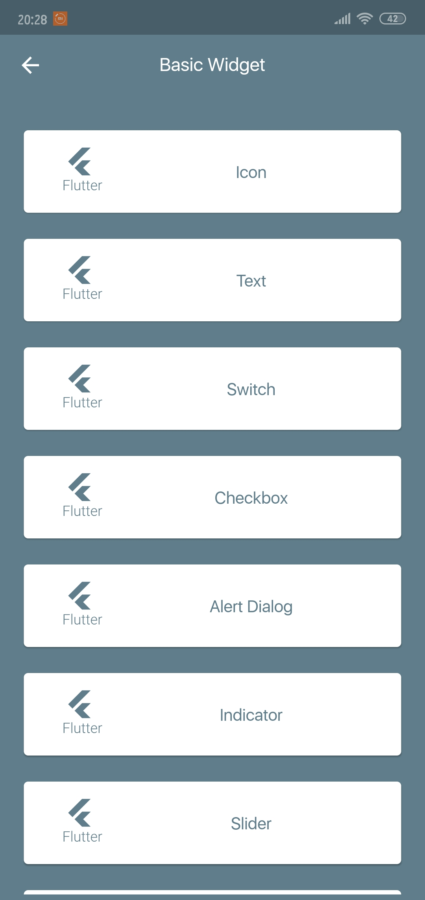
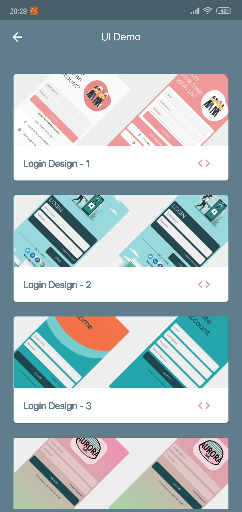

# Flutter-Widget-Gallery

-   
-  

- I am sharing the source code of widgets that you can use for Flutter. I share how useful packages are used and demo screen designs. If you want to try the application, the link is below.

- Play Store : https://play.google.com/store/apps/details?id=com.flutter.flutteruiapp
